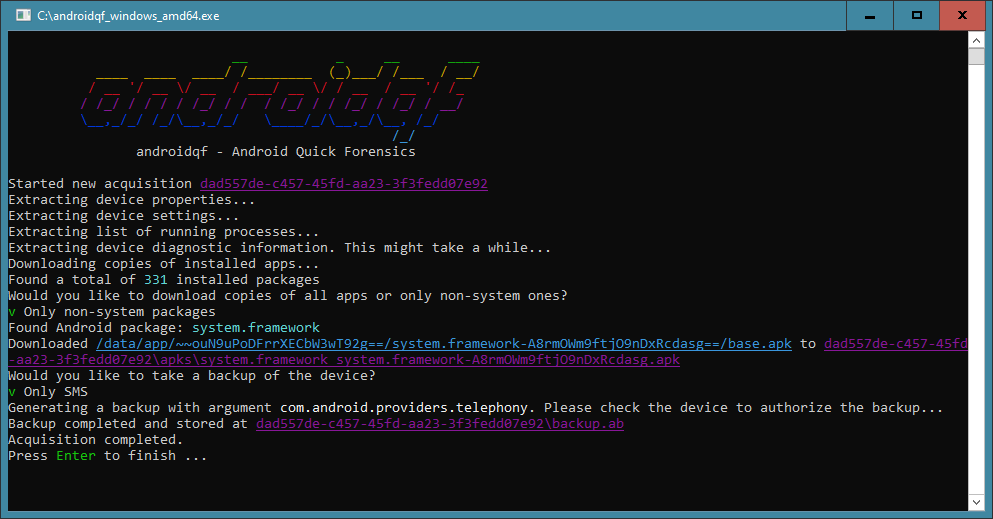

# androidqf

[](https://goreportcard.com/report/github.com/botherder/androidqf)

androidqf (Android Quick Forensics) is a portable tool to simplify the acquisition of relevant forensic data from Android devices.

[Download androidqf](https://github.com/botherder/androidqf/releases/latest)



## Build

Executable binaries for Linux, Windows and Mac should be available in the [latest release](https://github.com/botherder/androidqf/releases/latest). In case you have issues running the binary you might want to build it by yourself.

In order to build androidqf you will need Go 1.18+ installed. You will also need to install `make`. When ready you can clone the repository and run any of the following commands, for your platform of choice:

    make linux
    make darwin
    make windows

These commands will generate binaries in a *build/* folder.

## How to use

Before launching androidqf you need to have the target Android device connected to your computer via USB, and you will need to have enabled USB debugging. Please refer to the [official documentation](https://developer.android.com/studio/debug/dev-options#enable) on how to do this, but also be mindful that Android phones from different manufacturers might require different navigation steps than the defaults.

Once USB debugging is enabled, you can proceed launching androidqf. It will first attempt to connect to the device over the USB bridge, which should result in the Android phone to prompt you to manually authorize the host keys. Make sure to authorize them, ideally permanently so that the prompt wouldn't appear again.

Now androidqf should be executing and creating an acquisition folder at the same path you have placed your androidqf binary. At some point in the execution, androidqf will prompt you some choices: these prompts will pause the acquisition until you provide a selection, so pay attention.

Once the acquisition is completed, you should make sure to disable USB debugging and the developer options, or in any case restore the device to its original configuration.

## Encryption & Potential Threats

Carrying the androidqf acquisitions on an unencrypted drive might expose yourself, and even more so those you acquired data from, to significant risk. For example, you might be stopped at a problematic border and your androidqf drive could be seized. The raw data might not only expose the purpose of your trip, but it will also likely contain very sensitive data (for example list of applications installed, or even SMS messages).

Ideally you should have the drive fully encrypted, but that might not always be possible. You could also consider placing androidqf inside a [VeraCrypt](https://www.veracrypt.fr/) container and carry with it a copy of VeraCrypt to mount it. However, VeraCrypt containers are typically protected only by a password, which you might be forced to provide.

Alternatively, androidqf allows to encrypt each acquisition with a provided [age](https://age-encryption.org) public key. Preferably, this public key belongs to a keypair for which the end-user does not possess, or at least carry, the private key. In this way, the end-user would not be able to decrypt the acquired data even under duress.

If you place a file called `key.txt` in the same folder as the androidqf executable, androidqf will automatically attempt to compress and encrypt each acquisition and delete the original unencrypted copies.

Once you have retrieved an encrypted acquisition file, you can decrypt it with age like so:

```
$ age --decrypt -i ~/path/to/privatekey.txt -o <UUID>.zip <UUID>.zip.age
```

Bear in mind, it is always possible that at least some portion of the unencrypted data could be recovered through advanced forensics techniques - although we're working to mitigate that.

## License

The purpose of androidqf is to facilitate the ***consensual forensic analysis*** of devices of those who might be targets of sophisticated mobile spyware attacks, especially members of civil society and marginalized communities. We do not want androidqf to enable privacy violations of non-consenting individuals. Therefore, the goal of this license is to prohibit the use of androidqf (and any other software licensed the same) for the purpose of *adversarial forensics*.

In order to achieve this androidqf is released under [MVT License 1.1](https://license.mvt.re/1.1/), an adaptation of [Mozilla Public License v2.0](https://www.mozilla.org/MPL). This modified license includes a new clause 3.0, "Consensual Use Restriction" which permits the use of the licensed software (and any *"Larger Work"* derived from it) exclusively with the explicit consent of the person/s whose data is being extracted and/or analysed (*"Data Owner"*).
